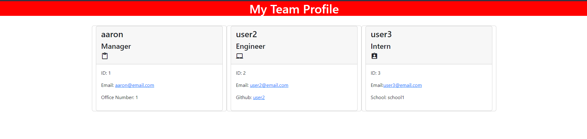

# Team Profile Generator

    
## Description

This is a Team Profile Generator. From the command line you will receive prompts on who is the manager, followed by if you wish to add engineers, or interns. Upon completion the app will create a HTML page with generated cards of the information you provided.

Video Demonstration Link:
https://drive.google.com/file/d/1oET6Vkyo48rCmB25gKTV9b72wadyFoyj/view

## Table of Contents

- [Team Profile Generator](#team-profile-generator)
  - [Description](#description)
  - [Table of Contents](#table-of-contents)
  - [Installation ](#installation-)
  - [Contact info: ](#contact-info-)
    
## Installation 

Type "npm i" in the terminal followed by "node index.js" to get started

The MIT License (MIT) Copyright © 2022 craymorgana

        Permission is hereby granted, free of charge, to any person obtaining a copy of this software and associated documentation files (the “Software”), to deal in the Software without restriction, including without limitation the rights to use, copy, modify, merge, publish, distribute, sublicense, and/or sell copies of the Software, and to permit persons to whom the Software is furnished to do so, subject to the following conditions:

        The above copyright notice and this permission notice shall be included in all copies or substantial portions of the Software.

        THE SOFTWARE IS PROVIDED “AS IS”, WITHOUT WARRANTY OF ANY KIND, EXPRESS OR IMPLIED, INCLUDING BUT NOT LIMITED TO THE WARRANTIES OF MERCHANTABILITY, FITNESS FOR A PARTICULAR PURPOSE AND NONINFRINGEMENT. IN NO EVENT SHALL THE AUTHORS OR COPYRIGHT HOLDERS BE LIABLE FOR ANY CLAIM, DAMAGES OR OTHER LIABILITY, WHETHER IN AN ACTION OF CONTRACT, TORT OR OTHERWISE, ARISING FROM, OUT OF OR IN CONNECTION WITH THE SOFTWARE OR THE USE OR OTHER DEALINGS IN THE SOFTWARE.

## Contact info: 
[Github](https://github.com/craymorgana?tab=repositories)